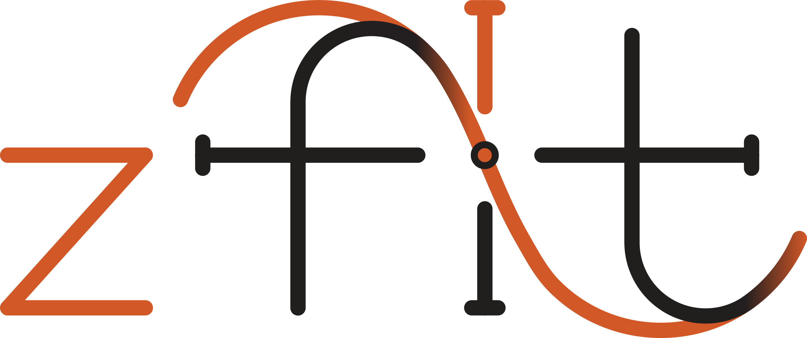
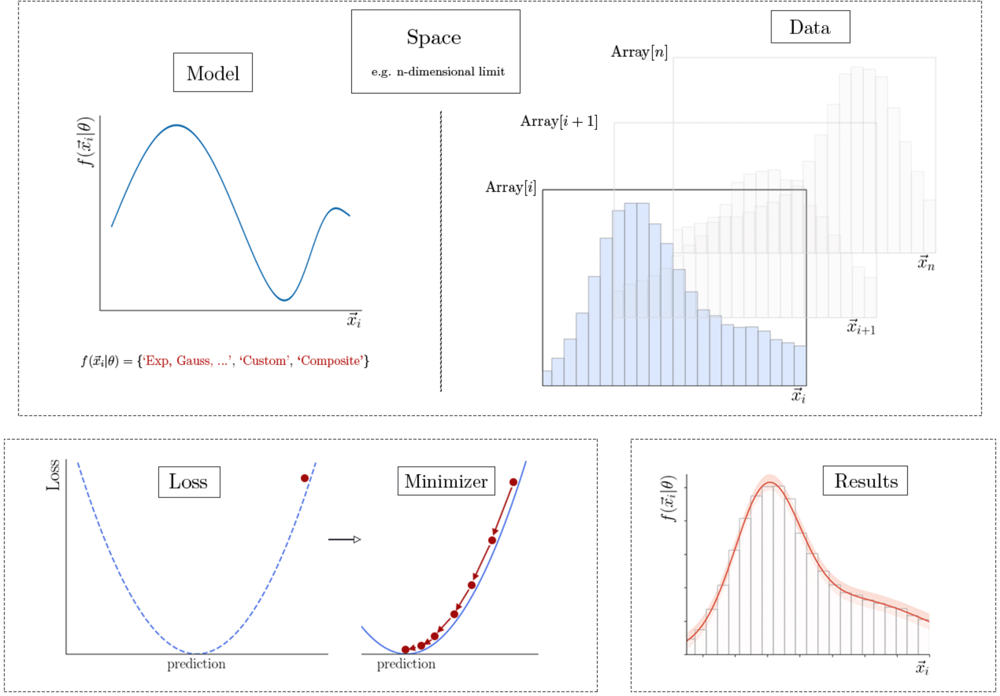

|zfit_logo|

*******************************
zfit: scalable pythonic fitting
*******************************

.. image:: https://scikit-hep.org/assets/images/Scikit--HEP-Affiliated-blue.svg
   :target: https://scikit-hep.org

.. image:: https://img.shields.io/badge/DOI-10.1016%2Fj.softx.2020.100508-yellow
   :target: https://www.sciencedirect.com/science/article/pii/S2352711019303851
   :alt: DOI 10.1016/j.softx.2020.100508

.. image:: https://img.shields.io/pypi/pyversions/zfit
   :target: https://pypi.org/project/zfit/
   :alt: PyPI - Python Version

.. image:: https://img.shields.io/pypi/v/zfit.svg
   :target: https://pypi.python.org/pypi/zfit

.. image:: https://img.shields.io/conda/vn/conda-forge/zfit
   :target: https://anaconda.org/conda-forge/zfit
   :alt: conda-forge

.. image:: https://img.shields.io/spack/v/py-zfit
   :target: https://github.com/spack/spack/blob/develop/var/spack/repos/builtin/packages/py-zfit/package.py

.. image:: https://github.com/zfit/zfit/workflows/build/badge.svg
   :target: https://github.com/zfit/zfit/actions

.. |scikit-hep_logo| image:: docs/images/scikit-hep-logo_168x168.png
   :target: https://scikit-hep.org/affiliated
   :alt: scikit-hep logo

zfit is a highly scalable and customizable model manipulation and likelihood fitting library. It uses the same computational backend as
`TensorFlow <https://www.tensorflow.org/>`_ and is optimised for simple and direct manipulation of probability density functions. The project is affiliated with
and well integrated into `Scikit-HEP <https://scikit-hep.org/>`_, the HEP Python ecosystem.

- **Tutorials**: `Interactive introduction and tutorials <https://zfit-tutorials.readthedocs.io/en/latest/>`_
- **Quick start**: `Example scripts <examples>`_
- **Documentation**: See `stable documentation`_ or `latest documentation`_
- **Questions**: see the `FAQ <https://github.com/zfit/zfit/wiki/FAQ>`_,
  `ask on StackOverflow <https://stackoverflow.com/questions/ask?tags=zfit>`_ (with the **zfit** tag) or `contact`_ us directly.
- **Physics, HEP**: `zfit-physics <https://github.com/zfit/zfit-physics>`_ is the place to contribute and find more HEP
  related content
- **Statistical inference**: `hepstats <https://github.com/scikit-hep/hepstats>`_ for limits, CI, sWeights and more

If you use zfit in **research**, please
consider `citing <https://www.sciencedirect.com/science/article/pii/S2352711019303851>`_.

*N.B.*: zfit is currently in *beta stage*, so while most core parts are established,
some may still be missing and bugs may be encountered.
It is, however, mostly ready for production, and is being used in analyses projects.
If you want to use it for your project and you are not sure if all the needed functionality is there,
feel free to `contact`_ us.

Installation
=============

zfit is available on pip and conda-forge. To install it (recommended: use a virtual/conda env!) with all the dependencies (minimizers, uproot, ...), use

.. code-block:: bash

   pip install -U zfit[all]

(the ``-U`` just indicates to upgrade zfit, in case you have it already installed)
or for minimal dependencies

.. code-block:: bash

   pip install zfit

For conda/mamba, use

.. code-block:: bash

   conda install -c conda-forge zfit

How to use
==========

While the zfit library provides a model fitting and sampling framework for a broad list of applications,
we will illustrate its main features with a simple example by fitting a Gaussian distribution with an unbinned
likelihood fit and a parameter uncertainty estimation.

Example in short
----------------
.. code-block:: python

    obs = zfit.Space('x', -10, 10)

    # create the model
    mu    = zfit.Parameter("mu"   , 2.4, -1, 5)
    sigma = zfit.Parameter("sigma", 1.3,  0, 5)
    gauss = zfit.pdf.Gauss(obs=obs, mu=mu, sigma=sigma)

    # load the data
    data_np = np.random.normal(size=10000)
    data = zfit.Data(obs=obs, data=data_np)
    # or sample from model
    data = gauss.sample()

    # build the loss
    nll = zfit.loss.UnbinnedNLL(model=gauss, data=data)

    # minimize (20+ interchangeable minimizers available!)
    minimizer = zfit.minimize.Minuit()
    result = minimizer.minimize(nll).update_params()

    # calculate errors
    sym_errors = result.hesse()
    asym_errors = result.errors()

This follows the zfit workflow

Full explanation
----------------

The default space (e.g. normalization range) of a PDF is defined by an *observable space*, which is created using the ``zfit.Space`` class:

.. code-block:: python

    obs = zfit.Space('x', -10, 10)

To create a simple Gaussian PDF, we define its parameters and their limits using the ``zfit.Parameter`` class.

.. code-block:: python

  # syntax: zfit.Parameter("any_name", value, lower, upper)
    mu    = zfit.Parameter("mu"   , 2.4, -1, 5)
    sigma = zfit.Parameter("sigma", 1.3,  0, 5)
    gauss = zfit.pdf.Gauss(obs=obs, mu=mu, sigma=sigma)

For simplicity, we create the dataset to be fitted starting from a numpy array, but zfit allows for the use of other sources such as ROOT files:

.. code-block:: python

    mu_true = 0
    sigma_true = 1
    data_np = np.random.normal(mu_true, sigma_true, size=10000)
    data = zfit.Data(obs=obs, data=data_np)

Fits are performed in three steps:

1. Creation of a loss function, in our case a negative log-likelihood.
2. Instantiation of our minimiser of choice, in the example the ``Minuit``.
3. Minimisation of the loss function.

.. code-block:: python

    # Stage 1: create an unbinned likelihood with the given PDF and dataset
    nll = zfit.loss.UnbinnedNLL(model=gauss, data=data)

    # Stage 2: instantiate a minimiser (in this case a basic minuit)
    minimizer = zfit.minimize.Minuit()

    # Stage 3: minimise the given negative log-likelihood
    result = minimizer.minimize(nll).update_params()

The ``.update_params()`` changes the default values of the parameters
(*this is currently happen by default but won't anymore in the future*)

Symmetric errors are calculated with a further function call to avoid running potentially expensive operations if not needed. Asymmetric errors using a
profiling method can also be obtained:

.. code-block:: python

    sym_errors = result.hesse()
    asym_errors = result.errors()

Once we've performed the fit and obtained the corresponding uncertainties, we can examine the fit results by printing it or looking at individual parts

.. code-block:: python

    print(result)  # nice representation of a whole result

    print("Function minimum:", result.fmin)
    print("Converged:", result.converged)

    # Information on all the parameters in the fit
    params = result.params
    print(params)

    # Printing information on specific parameters, e.g. mu
    print("mu={}".format(params[mu]['value']))

And that's it!
For more details and information of what you can do with zfit, checkout the `latest documentation`_.

Why?
====

The basic idea behind zfit is to offer a Python oriented alternative to the very successful RooFit library
from the `ROOT <https://root.cern.ch/>`_ data analysis package that can integrate with the other packages
that are part if the scientific Python ecosystem.
Contrary to the monolithic approach of ROOT/RooFit, the aim of zfit is to be light and flexible enough t
o integrate with any state-of-art tools and to allow scalability going to larger datasets.

These core ideas are supported by two basic pillars:

- The skeleton and extension of the code is minimalist, simple and finite:
  the zfit library is exclusively designed for the purpose of model fitting and sampling with no attempt to extend its
  functionalities to features such as statistical methods or plotting.

- zfit is designed for optimal parallelisation and scalability by making use of TensorFlow as its backend.
  The use of TensorFlow provides crucial features in the context of model fitting like taking care of the
  parallelisation and analytic derivatives.

Prerequisites
=============

``zfit`` works with Python versions 3.9 and above.
The main dependency is `tensorflow <https://www.tensorflow.org/>`_: zfit follows a close version compatibility with TensorFlow.

For a full list of all dependencies, check the `requirements <requirements.txt>`_.

Contributing
============

Any idea of how to improve the library? Or interested to write some code?
Contributions are always welcome, please have a look at the `Contributing guide`_.

.. _Contributing guide: CONTRIBUTING.rst

Contact
========

You can contact us directly:
 - via e-mail: zfit@physik.uzh.ch
 - join our `Gitter channel <https://gitter.im/zfit/zfit>`_

Original Authors
================

| Jonas Eschle <jonas.eschle@cern.ch>
| Albert Puig <albert.puig@cern.ch>
| Rafael Silva Coutinho <rsilvaco@cern.ch>

See here for `all authors and contributors`_

..  _all authors and contributors: AUTHORS.rst

Acknowledgements
================

zfit has been developed with support from the University of Zurich and the Swiss National Science Foundation (SNSF) under contracts 168169 and 174182.

The idea of zfit is inspired by the `TensorFlowAnalysis <https://gitlab.cern.ch/poluekt/TensorFlowAnalysis>`_ framework
developed by Anton Poluektov and `TensorProb <https://github.com/tensorprob/tensorprob>`_ by Chris Burr and Igor Babuschkin
using the TensorFlow open source library and more libraries.

.. _`latest documentation`: https://zfit.readthedocs.io/en/latest/
.. _`stable documentation`: https://zfit.readthedocs.io/en/stable/
