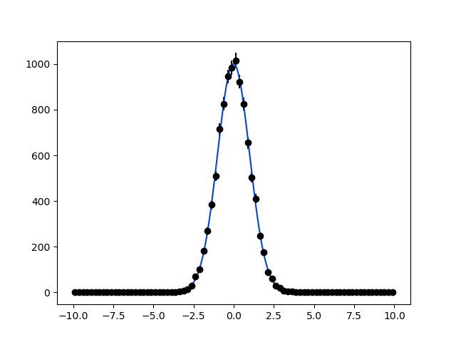

=========================
Getting started with zfit
=========================

The zfit library provides a simple model fitting and sampling framework for a broad list of applications. This section is designed to give an overview of the main concepts and features in the context of likelihood fits in a *crash course* manner. The simplest example is to generate, fit and plot a Gaussian distribution.

The first step is to naturally import ``zfit`` and verify if the installation has been done successfully:

.. code-block:: pycon

    >>> import tensorflow as tf
    >>> import zfit
    >>> print("TensorFlow version:", tf.__version__)
    TensorFlow version: 1.12.0

Since we want to generate/fit a Gaussian within a given range, the domain of the PDF is defined by an *observable space*. This can be created using the :py:class:`~zfit.Space` class

.. code-block:: pycon

    >>> obs = zfit.Space('x', limits=(-10, 10))

The best interpretation of the observable at this stage is that it defines the name and range of the observable axis.

Using this domain, we can now create a simple Gaussian PDF.
The most common PDFs are already pre-defined within the :py:mod:`~zfit.pdf` module, including a simple Gaussian.
First, we have to define the parameters of the PDF and their limits using the :py:class:`~zfit.Parameter` class:

.. code-block:: pycon

    >>> mu = zfit.Parameter("mu", 2.4, -1, 5)
    >>> sigma = zfit.Parameter("sigma", 1.3,  0, 5)

With these parameters we can instantiate the Gaussian PDF from the library

.. code-block:: pycon

    >>> gauss = zfit.pdf.Gauss(obs=obs, mu=mu, sigma=sigma)

It is recommended to pass the arguments of the PDF as keyword arguments.

The next stage is to create a dataset to be fitted. There are several ways of producing this within the zfit framework (see the :ref:`Data <data-section>` section). In this case, for simplicity we simply produce it using numpy and the :func:`Data.from_numpy <zfit.Data.from_numpy>` method:

.. code-block:: pycon

    >>> data_np = np.random.normal(0, 1, size=10000)
    >>> data = zfit.Data.from_numpy(obs=obs, array=data_np)

Now we have all the ingredients in order to perform a maximum likelihood fit. Conceptually this corresponds to three basic steps:

1. create a loss function, in our case a negative log-likelihood :math:`\log\mathcal{L}`;
2. instantiate our choice of minimiser; and
3. and minimise the log-likelihood.

.. code-block:: pycon

    >>> # Stage 1: create an unbinned likelihood with the given PDF and dataset
    >>> nll = zfit.loss.UnbinnedNLL(model=gauss, data=data)

    >>> # Stage 2: instantiate a minimiser (in this case a basic minuit
    >>> minimizer = zfit.minimize.Minuit()

    >>> # Stage 3: minimise the given negative likelihood
    >>> result = minimizer.minimize(nll)

This corresponds to the most basic example where the negative likelihood is defined within the pre-determined observable range and all the parameters in the PDF are floated in the fit. It is often the case that we want to only vary a given set of parameters. In this case it is necessary to specify which are the parameters to be floated (so all the remaining ones are fixed to their initial values).

.. code-block:: pycon

    >>> # Stage 3: minimise the given negative likelihood but floating only specific parameters (e.g. mu)
    >>> result = minimizer.minimize(nll, params=[mu])

It is important to highlight that conceptually zfit separates the minimisation of the loss function with respect to the error calculation, in order to give the freedom of calculating this error whenever needed and to allow the use of external error calculation packages.
Most minimisers will implement their CPU-intensive error calculating with the ``error`` method.
As an example, with the :py:class:`~zfit.minimize.Minuit` one can calculate the ``MINOS`` with:

.. code-block:: pycon

    >>> param_errors = result.error()
    >>> for var, errors in param_errors.items():
    ...   print('{}: ^{{+{}}}_{{{}}}'.format(var.name, errors['upper'], errors['lower']))
    mu: ^{+0.00998104141841555}_{-0.009981515893414316}
    sigma: ^{+0.007099472590970696}_{-0.0070162654764939734}

Once we've performed the fit and obtained the corresponding uncertainties, it is now important to examine the fit results.
The object ``result`` (:py:class:`~zfit.minimizers.fitresult.FitResult`) has all the relevant information we need:

.. code-block:: pycon

    >>> print("Function minimum:", result.fmin)
    Function minimum: 14170.396450111948
    >>> print("Converged:", result.converged)
    Converged: True
    >>> print("Full minimizer information:", result.info)
    Full minimizer information: {'n_eval': 56, 'original': {'fval': 14170.396450111948, 'edm': 2.8519671693442587e-10,
    'nfcn': 56, 'up': 0.5, 'is_valid': True, 'has_valid_parameters': True, 'has_accurate_covar': True, 'has_posdef_covar': True,
    'has_made_posdef_covar': False, 'hesse_failed': False, 'has_covariance': True, 'is_above_max_edm': False, 'has_reached_call_limit': False}}

Similarly one can obtain information on the fitted parameters with

.. code-block:: pycon

    >>> # Information on all the parameters in the fit
    >>> params = result.params

    >>> # Printing information on specific parameters, e.g. mu
    >>> print("mu={}".format(params[mu]['value']))
    mu=0.012464509810750313

As already mentioned, there is no dedicated plotting feature within zfit. However, we can easily use external libraries, such as ``matplotlib``, to do the job:

.. code-block:: pycon

    >>> # Some simple matplotlib configurations
    >>> import matplotlib.pyplot as plt
    >>> lower, upper = obs.limits
    >>> data_np = zfit.run(data)
    >>> counts, bin_edges = np.histogram(data_np, 80, range=(lower[-1][0], upper[0][0]))
    >>> bin_centres = (bin_edges[:-1] + bin_edges[1:])/2.
    >>> err = np.sqrt(counts)
    >>> plt.errorbar(bin_centres, counts, yerr=err, fmt='o', color='xkcd:black')

    >>> x_plot = np.linspace(lower[-1][0], upper[0][0], num=1000)
    >>> y_plot = zfit.run(gauss.pdf(x_plot, norm_range=obs))

    >>> plt.plot(x_plot, y_plot*data_np.shape[0]/80*obs.area(), color='xkcd:blue')
    >>> plt.show()

The plotting example above presents a distinctive feature that had not been shown in the previous exercises: the specific call to ``zfit.run``, a specialised wrapper around ``tf.Session().run``.
While actions like ``minimize`` or ``sample`` return Python objects (including numpy arrays or scalars), functions like ``pdf`` or ``integrate`` return TensorFlow graphs, which are lazy-evaluated.
To obtain the value of these PDFs, we need to execute the graph by using ``zfit.run``.

What did just happen?
---------------------

The core idea of TensorFlow is to use dataflow *graphs*, in which *sessions* run part of the graphs that are required. Since zfit has TensorFlow at its core, it also preserves this feature, but wrapper functions are used to hide the graph generation and graph running two-stage procedure in the case of high-level functions such as ``minimize``. However, it is worth noting that most of the internal objects that are built by zfit are intrinsically graphs that are executed by running the session:

.. code-block:: pycon

    zfit.run(TensorFlow_object)

One example is the Gauss PDF that has been shown above. The object ``gauss`` contains all the functions you would expect from a PDF, such as calculating a probability, calculating its integral, etc. As an example, let's calculate the probability for given values

.. code-block:: pycon

    >>> from zfit import z
    >>> consts = [-1, 0, 1]
    >>> probs = gauss.pdf(consts, norm_range=(-np.infty, np.infty))

    >>> # And now execute the tensorflow graph
    >>> result = zfit.run(probs)
    >>> print("x values: {}\nresult:   {}".format(consts, result))
    x values: [-1, 0, 1]
    result:   [0.24262615 0.39670691 0.24130008]

Integrating a given PDF for a given normalisation range also returns a graph, so it needs to be run using
    >>> from zfit import z
    >>> consts = [-1, 0, 1]
    >>> probs = gauss.pdf(consts, norm_range=(-np.infty, np.infty))

    >>> # And now execute the tensorflow graph
    >>> result = zfit.run(probs)
    >>> print("x values: {}\nresult:   {}".format(consts, result))
    x values: [-1, 0, 1]
    result:   [0.24262615 0.39670691 0.24130008]

Integrating a given PDF for a given normalisation range also returns a graph, so it needs to be run using
    >>> from zfit import ztf
    >>> consts = [-1, 0, 1]
    >>> probs = gauss.pdf(consts, norm_range=(-np.infty, np.infty))

    >>> # And now execute the tensorflow graph
    >>> result = zfit.run(probs)
    >>> print("x values: {}\nresult:   {}".format(consts, result))
    x values: [-1, 0, 1]
    result:   [0.24262615 0.39670691 0.24130008]

Integrating a given PDF for a given normalisation range also returns a graph, so it needs to be run using ``zfit.run``:

.. code-block:: pycon

    >>> with gauss.set_norm_range((-1e6, 1e6)):
    ...    print(zfit.run(gauss.integrate((-0.6, 0.6))))
    ...    print(zfit.run(gauss.integrate((-3, 3))))
    ...    print(zfit.run(gauss.integrate((-100, 100))))
    0.4492509559828224
    0.9971473939649167
    1.0

